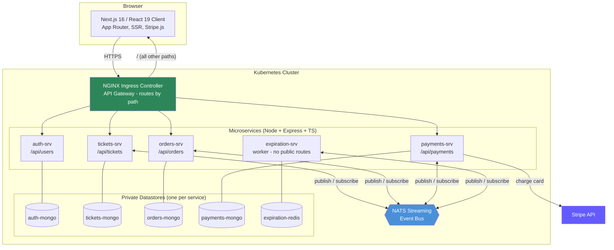
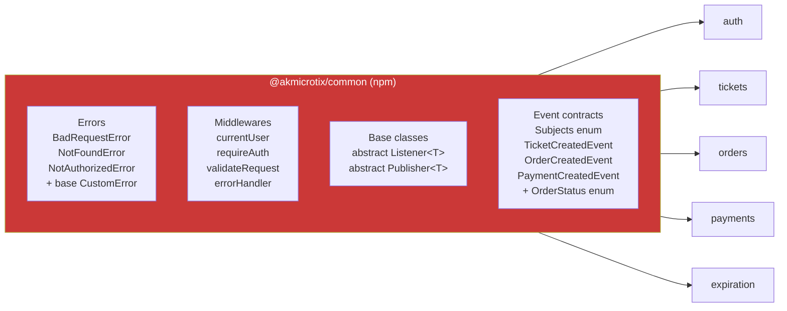
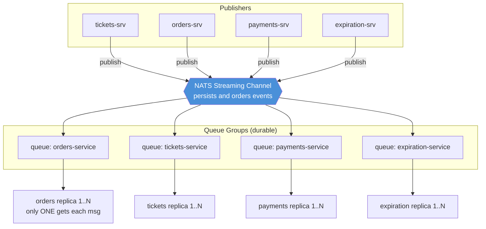
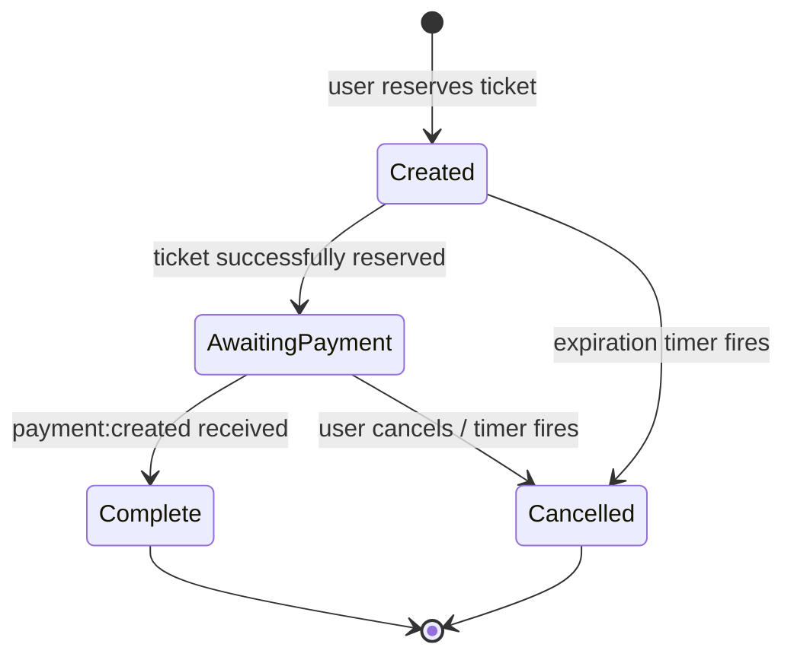
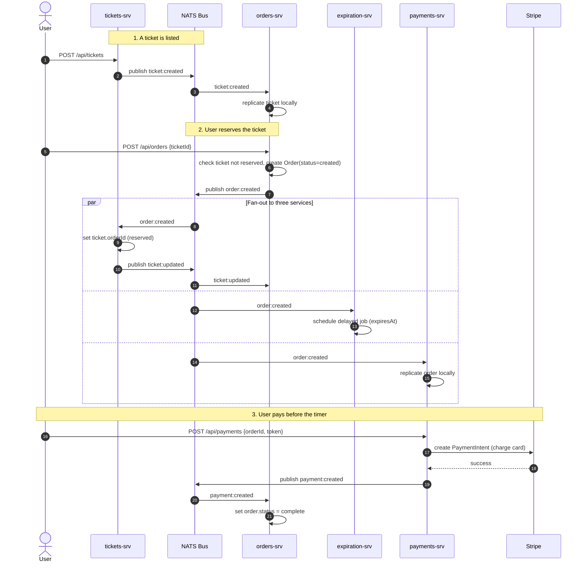
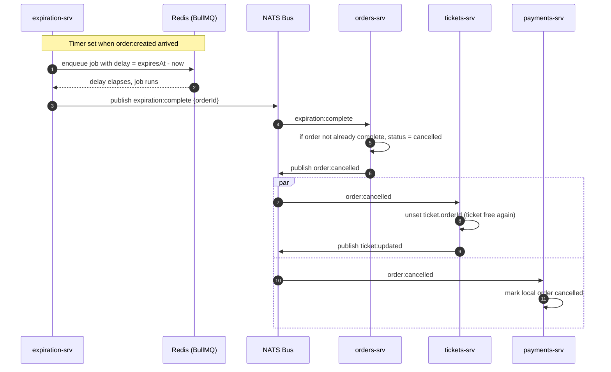
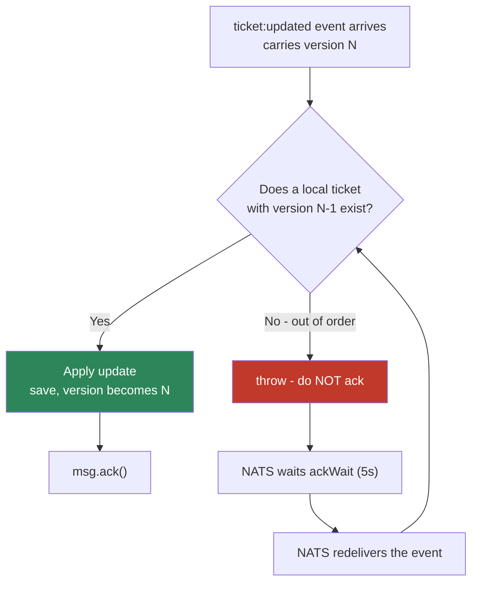
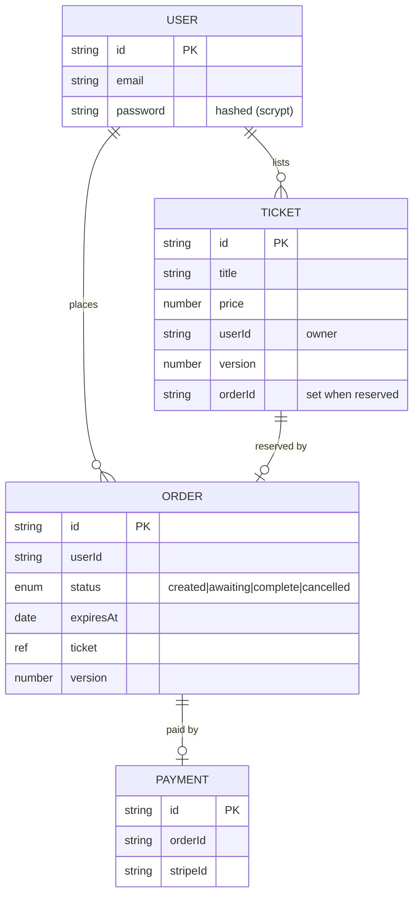
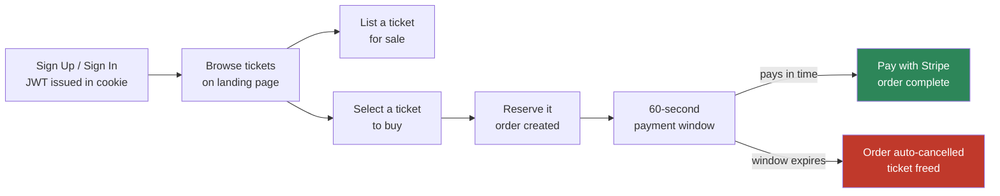
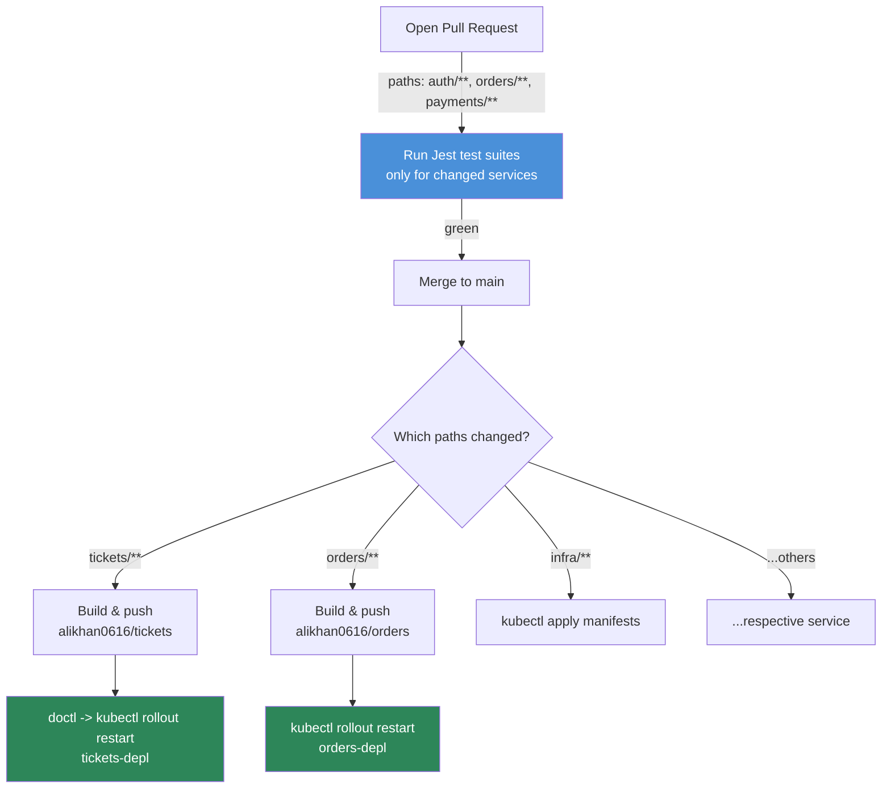

# MicroTix

### An Event-Driven Ticket Marketplace Built on a Production-Grade Microservices Architecture

> **Read this first:** MicroTix is a case study in **microservices architecture**, not in frontend polish. The Next.js client exists only to exercise the system end-to-end. The engineering story lives in the **six independently deployable services**, the **shared npm module** that binds them together, the **NATS Streaming event bus** that lets them talk without knowing about each other, and the **optimistic-concurrency strategy** that keeps their private databases consistent under race conditions.

---

## Table of Contents

- [Introduction / Overview](#introduction--overview)
- [Goals of the Project](#goals-of-the-project)
- [System Architecture](#system-architecture)
- [The Services](#the-services)
- [The `@akmicrotix/common` Shared Module](#the-akmicrotixcommon-shared-module-my-own-npm-package)
- [The Event Bus (NATS Streaming)](#the-event-bus-nats-streaming)
- [Event Catalogue](#event-catalogue)
- [Event Flow Through the Bus](#event-flow-through-the-bus)
- [The Concurrency Problem (and How I Solved It)](#the-concurrency-problem-and-how-i-solved-it)
- [Order Lifecycle & Expiration](#order-lifecycle--expiration)
- [Data Ownership Model](#data-ownership-model)
- [User Flow](#user-flow)
- [Testing Strategy](#testing-strategy)
- [CI/CD & Deployment](#cicd--deployment)
- [Tech Stack](#tech-stack)
- [Challenges and Solutions](#challenges-and-solutions)
- [Best Practices](#best-practices)
- [Conclusion](#conclusion)
- [Author](#author)

---

## Introduction / Overview

**MicroTix** is a ticket-reselling marketplace where users can list tickets for sale, reserve tickets from other users, and pay for them via Stripe. On the surface it behaves like any small e-commerce app: sign up, browse, reserve, pay. Underneath, it is deliberately **broken apart into six autonomous services**, each with its **own database**, communicating **exclusively through asynchronous events** on a shared message bus.

There is no shared database. There are no synchronous service-to-service HTTP calls in the business flow. Every service is free to be down, redeployed, or scaled independently — and the system still converges to a correct state because state changes are propagated as **immutable, versioned events**.

The entire backend is written in **TypeScript**, containerized with **Docker**, orchestrated with **Kubernetes**, developed locally with **Skaffold**, and deployed continuously to a **DigitalOcean Kubernetes cluster** via **GitHub Actions**.

This project was built to internalize the hard parts of distributed systems — not the happy path, but **data replication, eventual consistency, concurrency control, and inter-service contracts** — the problems that only appear once you refuse to share a database.

---

## Goals of the Project

- Design a system where services are **truly independent** — separate codebases, separate databases, separate deploy pipelines.
- Replace synchronous request/response coupling with **asynchronous, event-driven communication**.
- Solve **data consistency** across services that each hold their own copy of the same entity.
- Solve **concurrency / race conditions** using **optimistic concurrency control** and event **versioning**.
- Build a **shared contract layer** (published as a private npm package) so every service speaks the exact same event language, enforced by the TypeScript compiler.
- Handle **time-based workflows** (order expiration) reliably with a delayed job queue.
- Ship a real **CI/CD pipeline**: run tests on every PR, build & roll out only the changed service on every merge.
- Keep the frontend intentionally thin — the point was the backend architecture.

---

## System Architecture

MicroTix runs entirely inside a single Kubernetes cluster. An **NGINX Ingress Controller** acts as the API gateway, routing traffic to services purely by URL path. Every backend service owns a private MongoDB deployment, and all services connect to one **NATS Streaming** cluster for events. The **expiration** service additionally uses **Redis** as the backing store for its delayed-job queue.



**Key architectural rules enforced across the system:**

| Rule | Why it matters |
|------|----------------|
| **Database-per-service** | No service can query another's data directly. Coupling is impossible by construction. |
| **No sync inter-service calls in business logic** | Services never `await` each other over HTTP. They react to events. A downed service delays, but never breaks, the flow. |
| **Events are the only integration point** | The bus is the contract. If it's not an event, it didn't happen. |
| **Every replicated record carries a `version`** | Enables ordering and concurrency control (detailed below). |
| **Auth is stateless (JWT)** | The `auth` service issues a JWT stored in a `cookie-session`; every other service validates it locally using a shared `JWT_KEY` secret — no auth lookups per request. |

---

## The Services

| Service | Public Routes | Owns | Publishes | Listens For |
|---------|--------------|------|-----------|-------------|
| **auth** | `/api/users/*` (signup, signin, signout, currentuser) | Users, credentials | *(none)* | *(none)* |
| **tickets** | `/api/tickets/*` (create, read, update, list) | Tickets | `ticket:created`, `ticket:updated` | `order:created`, `order:cancelled` |
| **orders** | `/api/orders/*` (create, read, list, cancel) | Orders (+ a replica of Tickets) | `order:created`, `order:cancelled` | `ticket:created`, `ticket:updated`, `expiration:complete`, `payment:created` |
| **payments** | `/api/payments/*` (create charge) | Payments (+ a replica of Orders) | `payment:created` | `order:created`, `order:cancelled` |
| **expiration** | *(none — background worker)* | Delayed jobs (in Redis) | `expiration:complete` | `order:created` |
| **client** | serves all remaining paths | — | — | — |

Notice that **orders** and **payments** keep local **replicas** of data they don't own (tickets, orders). This is the deliberate trade-off of a share-nothing architecture: instead of asking another service for data at request time, each service maintains just enough of a local copy — kept fresh by events — to answer its own questions instantly and independently.

---

## The `@akmicrotix/common` Shared Module (my own npm package)

Early on I hit a problem that every real microservices project hits: **six services all need the exact same definitions.** They all throw the same custom errors, run the same auth middleware, and — most importantly — must agree byte-for-byte on the **shape of every event**. If `tickets` publishes `{ id, version, title, price }` and `orders` expects `{ id, ver, title, cost }`, the system silently corrupts itself and no compiler will warn you, because the two services don't share code.

Copy-pasting shared files across services was a non-starter — they'd drift instantly. So I extracted the shared contract into its own package and **published it to npm as [`@akmicrotix/common`](https://www.npmjs.com/package/@akmicrotix/common)** (currently `v1.0.21`). Every service installs it as a normal dependency:

```jsonc
// each service's package.json
"dependencies": {
  "@akmicrotix/common": "^1.0.5",
  ...
}
```

**What lives in the common module:**



The most valuable pieces are the **generic base classes**. `Publisher<T>` and `Listener<T>` are abstract classes parameterized by an event interface. A concrete listener only has to declare *which* subject it cares about and *what to do* with the data — the base class handles subscription options, durable naming, manual acks, JSON parsing, and reconnection semantics:

```ts
// common/src/events/baseEvents/base-listner.ts
abstract class Listener<T extends Event> {
  abstract subject: T["subject"];
  abstract queueGroupName: string;
  abstract onMessage(data: T["data"], msg: Message): void;
  private ackWait = 5 * 1000;

  subscriptionOptions() {
    return this.client.subscriptionOptions()
      .setDeliverAllAvailable()   // replay history to new subscribers
      .setManualAckMode(true)     // we ack only after successful processing
      .setAckWait(this.ackWait)   // redeliver if not acked in 5s
      .setDurableName(this.queueGroupName);
  }
  // listen(), parseMessage() ...
}
```

Because the event data types (`TicketCreatedEvent`, `OrderCreatedEvent`, …) are shared and generic, **TypeScript enforces the event contract at compile time across every service.** If I change a field on `OrderCreatedEvent` in the package and bump the version, every consuming service fails to compile until it's updated. The contract is no longer a hope — it's a type.

> **Workflow note:** the package has a `pub` script (`npm version patch && npm run build && npm publish`) so a contract change is: edit → publish → `npm update` in each service. The version history of the package (`1.0.21`) is essentially the changelog of the system's event contracts.

---

## The Event Bus (NATS Streaming)

All inter-service communication flows through **NATS Streaming**. I chose it (over raw NATS or a heavier broker) specifically for the features that make eventual consistency tractable:

- **Queue groups** — multiple replicas of the same service form one queue group, so an event is delivered to **exactly one instance** of each service. This is what makes horizontal scaling safe: run 3 copies of `orders` and each event is still processed once.
- **Durable subscriptions** — NATS remembers how far each queue group has read. A service that was offline gets everything it missed on reconnect, instead of silently dropping events.
- **Manual acknowledgement + `ackWait`** — a message is only marked done after `onMessage` succeeds. If processing throws or the service dies, NATS **redelivers** after 5 seconds. At-least-once delivery, by design.



Each service wraps the raw client in a small singleton `NatsWrapper` and, on startup, registers all of its listeners before it begins serving traffic (see `orders/src/index.ts`).

---

## Event Catalogue

Six event types make up the entire language of the system. Every one is a TypeScript interface in `@akmicrotix/common`:

| Subject | Emitted by | Payload (key fields) | Consumed by |
|---------|-----------|----------------------|-------------|
| `ticket:created` | tickets | `id, version, title, price, userId` | orders |
| `ticket:updated` | tickets | `id, version, title, price, userId, orderId?` | orders |
| `order:created` | orders | `id, version, status, userId, expiresAt, ticket{id,price}` | tickets, payments, expiration |
| `order:cancelled` | orders | `id, version, ticket{id}` | tickets, payments |
| `expiration:complete` | expiration | `orderId` | orders |
| `payment:created` | payments | `id, orderId, stripeId` | orders |

And the order state machine (`OrderStatus`) that these events drive:



---

## Event Flow Through the Bus

This is the heart of the system: how a single user action ripples across services as a **chain of events**, with no service ever directly calling another. Below is the full **happy path** — reserving a ticket and paying for it — traced through the bus.



And the **expiration path** — what happens when the user *doesn't* pay in time:



The elegant part: **the ticket is freed automatically.** No cron job scans the database, no service polls for stale orders. The `order:cancelled` event flows to `tickets`, which unsets `orderId`, which makes the ticket reservable again — and publishes *another* `ticket:updated` so every replica stays in sync.

---

## The Concurrency Problem (and How I Solved It)

This was the single hardest — and most educational — problem in the project.

### The problem

Because services communicate over an **asynchronous, at-least-once** bus, two things are true at once:

1. **Events can arrive out of order.** NATS may redeliver, and network timing means a service could theoretically process a *newer* update before an *older* one.
2. **The same entity is replicated in multiple services.** A ticket exists in `tickets` (source of truth) *and* in `orders` (replica). They must never disagree.

Concretely, imagine a ticket is edited twice in quick succession. Two `ticket:updated` events fire: version A (price $20) and version B (price $25). If the `orders` service processes B then A, its replica ends up at $20 — **permanently wrong**, silently. This is a classic distributed race condition, and the naive "just save whatever arrives" approach is broken.

There's a second flavor of the same bug *inside* a single service: two requests fetch the same document, both edit it in memory, and both save — the second save clobbers the first (lost update).

### The solution: Optimistic Concurrency Control via a version number

Every record that gets replicated carries a **`version` field**, and I use the [`mongoose-update-if-current`](https://www.npmjs.com/package/mongoose-update-if-current) plugin to enforce OCC at the database level:

```ts
// tickets/src/models/ticketSchema.ts
ticketSchema.set("versionKey", "version");
ticketSchema.plugin(updateIfCurrentPlugin);
```

This changes the semantics of `save()`. Instead of `UPDATE ... WHERE _id = X`, Mongoose now issues `UPDATE ... WHERE _id = X AND version = <the version I loaded>`, and **increments `version` on success**. If someone else already bumped the version, the `WHERE` matches nothing, the save fails, and I know a concurrent modification happened.

**Within a service**, this turns the lost-update race into a hard error — proven by a real test:

```ts
// tickets/src/routes/__test__/concurrencyTest.test.ts
const firstInstance  = await Ticket.findById(ticket.id);
const secondInstance = await Ticket.findById(ticket.id);

firstInstance?.set({ price: 20 });
secondInstance?.set({ price: 25 });

await firstInstance?.save();                              // version 0 -> 1
await expect(secondInstance?.save()).rejects.toThrow();  // still expects version 0 -> rejected
```

**Across services**, the version becomes an **ordering guarantee.** Every event carries the record's version, and a replica will only apply an update if it is the *immediate next* version it expects. I encoded this as a custom Mongoose static method:

```ts
// orders/src/models/ticketSchema.ts
ticketSchema.statics.findByEvent = (event: { id: string; version: number }) => {
  return Ticket.findOne({
    _id: event.id,
    version: event.version - 1,   // only match the record ONE version behind
  });
};
```

```ts
// orders/src/events/listeners/ticket-updated-listner.ts
const ticket = await Ticket.findByEvent(data);
if (!ticket) {
  // Version mismatch - this event is out of order.
  // We do NOT ack, so NATS redelivers it later, after the missing event lands.
  throw new Error("Ticket not found or Version Mismatch");
}
```

The trick is in what happens on mismatch: **the listener throws instead of acking.** NATS redelivers the event after `ackWait`. By the time it comes back, the missing intermediate event has (very likely) been processed, versions line up, and the update applies cleanly. **Out-of-order delivery self-heals** — no manual reordering buffer required.



This one pattern — **version everything, apply strictly in sequence, let redelivery fix ordering** — is what makes the whole share-nothing design actually consistent. It was the concept that took the longest to truly *get*, and seeing the concurrency test go green was the most satisfying moment of the build.

---

## Order Lifecycle & Expiration

Reserved tickets shouldn't be locked forever if the buyer walks away. When an order is created, the `orders` service stamps it with an `expiresAt` and publishes it. The **expiration** service listens for `order:created` and enqueues a **delayed job** in **BullMQ** (backed by Redis), with the delay computed as `expiresAt - now`:

```ts
// expiration/src/events/listeners/order-created-listener.ts
const delay = new Date(data.expiresAt).getTime() - new Date().getTime();
await expirationQueue.add("expire-order", { orderId: data.id }, { delay });
```

When the delay elapses, the BullMQ worker publishes `expiration:complete`, and the cancellation chain from the sequence diagram above kicks in. Redis + BullMQ gives me **durable, precise, delayed scheduling** without a polling loop — the job simply doesn't run until its time comes, and it survives restarts because the queue is persisted in Redis.

---

## Data Ownership Model

Each service's database holds only what it owns, plus lean replicas of what it needs. There is **no shared schema and no foreign keys across service boundaries** — relationships are maintained by events.



- **auth-mongo** → `USER`
- **tickets-mongo** → `TICKET` (source of truth)
- **orders-mongo** → `ORDER` + a `TICKET` replica (title/price/version, kept fresh by events)
- **payments-mongo** → `PAYMENT` + an `ORDER` replica (price/status/version)

Passwords are hashed with Node's built-in **scrypt** (via a small `Password` service in `auth`), never stored in plaintext, and never leave the `auth` service — no other service ever sees credentials.

---

## User Flow

The frontend is intentionally minimal, but here's the journey it drives:



- **Auth:** stateless JWT stored in a `cookie-session` cookie, validated locally by every service via the shared `currentUser` / `requireAuth` middleware.
- **Client:** Next.js 16 (App Router) with server-side data fetching. A tiny `build-client` axios factory handles the difference between browser requests and SSR requests (which must talk to the ingress through the cluster's internal DNS). A `use-request` hook centralizes API calls and error rendering.
- **Payments:** Stripe.js collects the card token client-side; the token is exchanged for a real charge server-side in the `payments` service.

---

## Testing Strategy

Testing a distributed system is hard because you can't spin up the whole cluster for a unit test. My approach: **test each service in complete isolation, and mock the one thing it can't control — the event bus.**

**The stack:** `Jest` + `ts-jest` + `supertest` (HTTP assertions) + `mongodb-memory-server` (a real, in-memory MongoDB spun up fresh per test run).

**Key techniques:**

1. **In-memory Mongo per suite.** Each service boots a throwaway MongoDB in `beforeAll` and wipes every collection in `beforeEach`, so tests are hermetic and order-independent (`tickets/src/test/setup.ts`).

2. **The NATS client is mocked.** Every service has a `src/__mocks__/nats-wrapper.ts`, and setup calls `jest.mock("../nats-wrapper")`. Publishers still get *called* — I just assert on the mock — so I can verify **"did this route publish the right event?"** without a running bus:

   ```ts
   expect(natsWrapper.client.publish).toHaveBeenCalled();
   ```

3. **Listeners are tested directly.** I construct a listener, hand it a fake event `data` and a **fake `msg` with a spy on `.ack()`**, invoke `onMessage`, then assert on both the database state *and* whether `ack()` was called — proving the ordering/concurrency logic works.

4. **Auth is faked, not performed.** A shared `authHelper` mints a valid signed JWT cookie in-process, so protected routes can be tested without going through the real auth service.

5. **The concurrency guarantee is a first-class test** (shown above) — OCC isn't just assumed, it's asserted.

**Coverage — 21 test files across the services:**

| Service | What's covered |
|---------|----------------|
| auth | signup, signin, signout, current-user |
| tickets | create, read, list, update, **optimistic concurrency**, order-created & order-cancelled listeners |
| orders | create, read, list, delete/cancel, ticket-created / ticket-updated / expiration-complete listeners |
| payments | create-payment (Stripe mocked), order-created & order-cancelled listeners |

Stripe itself is mocked (`payments/src/__mocks__/stripe.ts`) so payment tests never hit the network.

---

## CI/CD & Deployment

The whole system deploys continuously to a **DigitalOcean Kubernetes cluster** via **GitHub Actions**, with a pipeline designed around the same principle as the architecture: **each service is independent.**



- **Path-filtered workflows.** A change under `orders/**` only builds, pushes, and redeploys the `orders` image — the other five services are untouched. Editing `infra/**` re-applies the Kubernetes manifests. This is CI/CD that respects service boundaries.
- **Test gate on PRs.** `tests-*.yml` workflows run `npm run test:ci` for the affected service before anything can merge.
- **Deploy on merge.** `deploy-*.yml` workflows build the Docker image, push it to Docker Hub, then use `doctl` to authenticate and `kubectl rollout restart` the deployment for a zero-manual-step release.
- **Local dev = Skaffold.** `skaffold.yaml` builds all images, applies the manifests, and — crucially — **syncs source files into running containers** (`ts-node-dev --respawn` inside each pod), so saving a `.ts` file hot-reloads the service in the cluster without a rebuild. Local development feels like a monolith even though it's running six containers.

---

## Tech Stack

**Backend (per service)**
- Node.js + **Express** + **TypeScript**
- **Mongoose** / **MongoDB** (one database per service)
- **`mongoose-update-if-current`** for optimistic concurrency control
- `express-validator`, `cookie-session`, `jsonwebtoken`, `express-async-errors`

**Messaging & Async**
- **NATS Streaming** (`node-nats-streaming`) — the event bus
- **BullMQ** + **Redis** (`ioredis`) — delayed jobs for order expiration

**Shared Contracts**
- **`@akmicrotix/common`** — my own published npm package (errors, middleware, event definitions, generic Publisher/Listener base classes)

**Payments**
- **Stripe** (server-side PaymentIntents + Stripe.js on the client)

**Frontend**
- **Next.js 16** (App Router) + **React 19**, **axios**, `@stripe/react-stripe-js`
- **Biome** for lint/format

**Infrastructure & DevOps**
- **Docker** (multi-service images) + **Docker Hub**
- **Kubernetes** on **DigitalOcean** + **NGINX Ingress** as API gateway
- **Skaffold** for local dev with hot-reload sync
- **GitHub Actions** for path-filtered CI/CD

**Testing**
- **Jest**, **ts-jest**, **supertest**, **mongodb-memory-server**

---

## Challenges and Solutions

### Inter-service communication without coupling
**Challenge:** Six services need to react to each other's changes, but direct HTTP calls would make them fragile and tightly coupled — one service down breaks the chain.
**Solution:** Adopted **asynchronous event-driven communication** over **NATS Streaming**. Services publish facts and react to facts; none of them knows the others exist. Queue groups + durable subscriptions make delivery scalable and crash-safe.

### The need for a shared contract
**Challenge:** All services must agree exactly on event shapes, errors, and auth logic — but they share no code, so definitions drift and break integration silently.
**Solution:** Extracted everything shared into **`@akmicrotix/common`** and **published it to npm**. Generic `Publisher<T>`/`Listener<T>` base classes plus shared event interfaces mean the **TypeScript compiler enforces the event contract** across all six services. Versioned publishes (`npm version patch`) make contract changes explicit and traceable.

### Concurrency & out-of-order events (the big one)
**Challenge:** With at-least-once, potentially out-of-order delivery, replicated records could be corrupted by concurrent edits or events processed in the wrong sequence.
**Solution:** **Optimistic Concurrency Control** — every record carries a `version` (via `mongoose-update-if-current`). Cross-service replicas only apply the event whose version is exactly `current + 1` (`findByEvent` matching `version - 1`); on mismatch the listener **refuses to ack**, and NATS redelivery lets the system **self-heal into the correct order.** Proven with a dedicated concurrency test.

### Time-based order expiration
**Challenge:** Reserved tickets must auto-release after a timeout, without polling the database.
**Solution:** A dedicated **expiration** service enqueues a **delayed BullMQ job** in **Redis** the moment an order is created. When it fires, it emits `expiration:complete`, triggering the cancellation event chain that frees the ticket automatically.

### Testing a distributed system
**Challenge:** You can't run the whole cluster to unit-test one service.
**Solution:** Isolate each service — **in-memory MongoDB** per run and a **mocked NATS wrapper** — so I can assert both "did it publish the right event?" and "did it handle an incoming event correctly (and ack)?" without any real infrastructure.

### Independent, safe deployments
**Challenge:** Redeploying everything on every commit is slow and risky.
**Solution:** **Path-filtered GitHub Actions** — only the changed service is tested, built, and rolled out via `doctl` + `kubectl`. Boundaries respected end to end, from code to production.

---

## Best Practices

- **Database-per-service** with zero cross-service queries — coupling is impossible by design.
- **Event-driven, at-least-once messaging** with manual acks and durable subscriptions.
- **Optimistic concurrency control + event versioning** for correctness under races and reordering.
- **Shared contract as a versioned npm package**, enforced by the type system.
- **Stateless JWT auth** validated locally by every service (no per-request auth lookups).
- **Secrets via Kubernetes Secrets** (`JWT_KEY`), config via env vars in manifests.
- **Comprehensive isolated testing** (in-memory DB + mocked bus) with a CI test gate on every PR.
- **Path-filtered CI/CD** so each service builds and deploys independently.
- **Skaffold hot-reload** for a monolith-like local dev experience across many containers.

---

## Conclusion

MicroTix looks like a simple ticket app, but it was never about the app — it was about learning to build systems that stay correct when they're split apart. Refusing a shared database forced me to confront the real problems of distributed computing head-on: **how do services agree without talking directly, how does data stay consistent when it lives in six places, and how do you stay correct when messages arrive late, twice, or out of order?**

The answers — an event bus, a shared and versioned contract, and optimistic concurrency control — are the same patterns that run real production systems. Getting the concurrency test to pass, and watching an out-of-order event *heal itself* through redelivery, was the moment distributed systems stopped being theory for me.

> "The real product of building software isn't just the app — it's the engineer you become by building it."

---

## Author

**Muhammad Ali Khan**
Full-Stack Developer | Microservices & Distributed Systems | Event-Driven Architecture | TypeScript

- LinkedIn: [linkedin.com/in/m-alikhan0616](https://www.linkedin.com/in/m-alikhan0616/)
- GitHub: [github.com/alikhan0616](https://github.com/alikhan0616)
- Email: [m.akhan0616@gmail.com](mailto:m.akhan0616@gmail.com)
- npm: [@akmicrotix/common](https://www.npmjs.com/package/@akmicrotix/common)

---

## License

This project is licensed under the MIT License.
